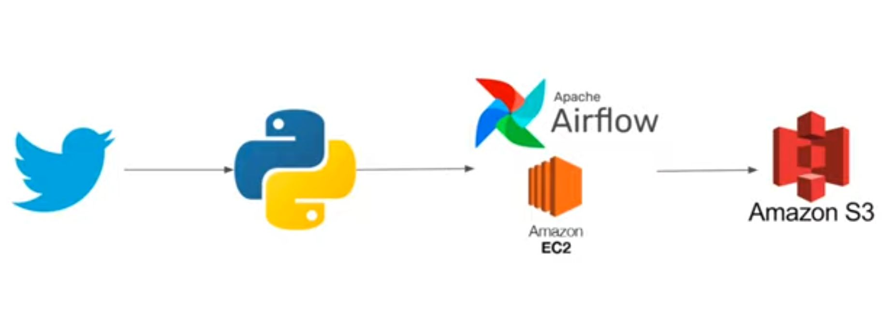

# End-to-End Data Engineering Project

## Introduction

This repository showcases a comprehensive data engineering project, covering everything from real-time data extraction using the X API (formerly Twitter) to data transformation with Python and workflow management with Apache Airflow deployed on AWS EC2. Finally, the processed data is stored in Amazon S3. This project demonstrates how to integrate modern data engineering tools and cloud infrastructure to build a robust workflow.



In this project, we’ll walk through an end-to-end data engineering pipeline where we:

1. Extract real-time data using the X (formerly Twitter) API.
2. Transform the data using Python.
3. Orchestrate the workflow using Apache Airflow deployed on AWS EC2.
4. Store the processed data on Amazon S3.

This project demonstrates how to integrate modern data engineering tools and cloud infrastructure to build a robust pipeline.

---

## Project Overview

### Key Steps:

- **Data Extraction**: Using X API to fetch real-time data.
- **Data Transformation**: Cleaning and transforming the data with Python.
- **Orchestration**: Deploying the pipeline on Airflow hosted on AWS EC2.
- **Storage**: Storing the transformed data in Amazon S3.

---

## Tools and Technologies

- **Python**: For fetching and processing data.
- **X API (formerly Twitter API)**: To extract real-time posts.
- **Apache Airflow**: To automate and schedule the workflow.
- **AWS EC2**: To host Airflow.
- **Amazon S3**: For data storage.

---

## Implementation

### Step 1: Extract Data Using X API

To extract data from X, you’ll need to create a developer account and generate the necessary credentials.

```bash
pip install tweepy
```

#### Sample Python Script:

```python
import tweepy
import json

# X API credentials
API_KEY = 'your_api_key'
API_SECRET = 'your_api_secret'
ACCESS_TOKEN = 'your_access_token'
ACCESS_SECRET = 'your_access_secret'

# Set up tweepy client
auth = tweepy.OAuthHandler(API_KEY, API_SECRET)
auth.set_access_token(ACCESS_TOKEN, ACCESS_SECRET)
api = tweepy.API(auth)

# Fetch posts
def fetch_posts(keyword, count=100):
    posts = tweepy.Cursor(api.search_tweets, q=keyword, lang='en').items(count)
    post_list = []
    for post in posts:
        post_list.append(post._json)
    return post_list

# Store the fetched data in JSON format
posts_data = fetch_posts('Data Engineering', 100)
with open('raw_posts.json', 'w') as file:
    json.dump(posts_data, file)
```

This script fetches posts containing the keyword "Data Engineering" and saves the raw JSON data into a file.

---

### Step 2: Data Transformation Using Python

After extraction, the data needs to be cleaned and transformed to make it usable. We will extract key information such as post text, user, and timestamp.

#### Sample Transformation Script:

```python
import json
import pandas as pd

# Load raw posts
with open('raw_posts.json', 'r') as file:
    posts_data = json.load(file)

# Transform the data
def transform_posts(posts):
    post_list = []
    for post in posts:
        post_list.append({
            'text': post['text'],
            'user': post['user']['screen_name'],
            'created_at': post['created_at'],
            'retweet_count': post['retweet_count'],
            'favorite_count': post['favorite_count']
        })
    return post_list

# Convert to DataFrame
transformed_posts = transform_posts(posts_data)
df = pd.DataFrame(transformed_posts)
df.to_csv('transformed_posts.csv', index=False)
```

Here, relevant fields are extracted from the raw JSON data, and the cleaned data is saved as a CSV file.

---

### Step 3: Orchestration with Apache Airflow on EC2

Apache Airflow will be used to automate the extraction, transformation, and loading (ETL) process. We will deploy Airflow on an EC2 instance.

#### Setting up Airflow on EC2

1. **Launch EC2 Instance**
2. **Install Airflow**:

```bash
sudo apt-get update
sudo apt-get install python3-pip
pip3 install apache-airflow
```

3. **Start Airflow**:

```bash
airflow db init
airflow webserver --port 8080
airflow scheduler
```

#### Creating Airflow DAG for the Data Pipeline

```python
from airflow import DAG
from airflow.operators.python_operator import PythonOperator
from datetime import datetime

# Import functions from previous scripts
from fetch_posts import fetch_posts
from transform_posts import transform_posts

def extract_data(**context):
    posts = fetch_posts('Data Engineering', 100)
    context['ti'].xcom_push(key='raw_posts', value=posts)

def transform_data(**context):
    raw_posts = context['ti'].xcom_pull(key='raw_posts')
    transformed_data = transform_posts(raw_posts)
    context['ti'].xcom_push(key='transformed_posts', value=transformed_data)

def load_data(**context):
    import boto3
    transformed_posts = context['ti'].xcom_pull(key='transformed_posts')
    df = pd.DataFrame(transformed_posts)
    df.to_csv('transformed_posts.csv', index=False)
    
    s3 = boto3.client('s3')
    s3.upload_file('transformed_posts.csv', 'your-s3-bucket', 'transformed_posts.csv')

default_args = {
    'owner': 'airflow',
    'start_date': datetime(2024, 1, 1),
    'retries': 1,
}

with DAG('x_data_pipeline', default_args=default_args, schedule_interval='@daily') as dag:
    
    extract_task = PythonOperator(task_id='extract_data', python_callable=extract_data, provide_context=True)
    
    transform_task = PythonOperator(task_id='transform_data', python_callable=transform_data, provide_context=True)
    
    load_task = PythonOperator(task_id='load_data', python_callable=load_data, provide_context=True)

    extract_task >> transform_task >> load_task
```

This DAG schedules tasks to extract, transform, and load data from X.

---

### Step 4: Store Data in Amazon S3

Once the data is transformed, it is stored in Amazon S3 using boto3.

#### Sample S3 Upload Function:

```python
import boto3

def load_data_to_s3(file_name, bucket_name):
    s3 = boto3.client('s3')
    s3.upload_file(file_name, bucket_name, file_name)

# Example usage
load_data_to_s3('transformed_posts.csv', 'my-s3-bucket')
```

---

## Conclusion

This project demonstrates how to build an end-to-end data pipeline using real-time data from X (formerly Twitter). By leveraging Python for data processing, Airflow for orchestration, and AWS for cloud hosting and storage, we can automate and scale the pipeline for handling large datasets.

### Key Learnings:

- **X API**: Provides access to real-time posts.
- **Python**: Simplifies data transformation and manipulation.
- **Airflow**: Automates the entire workflow.
- **AWS (EC2 and S3)**: Supports scalable storage and hosting.

This is an efficient and scalable solution for extracting and processing real-time social media data in a structured way.
